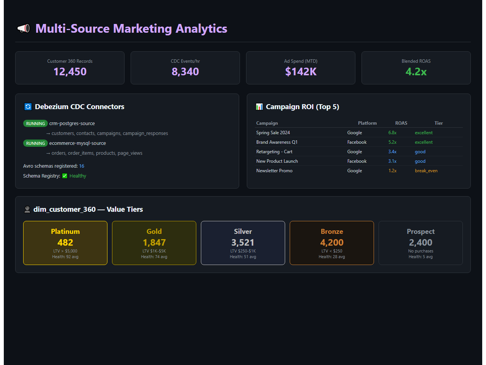
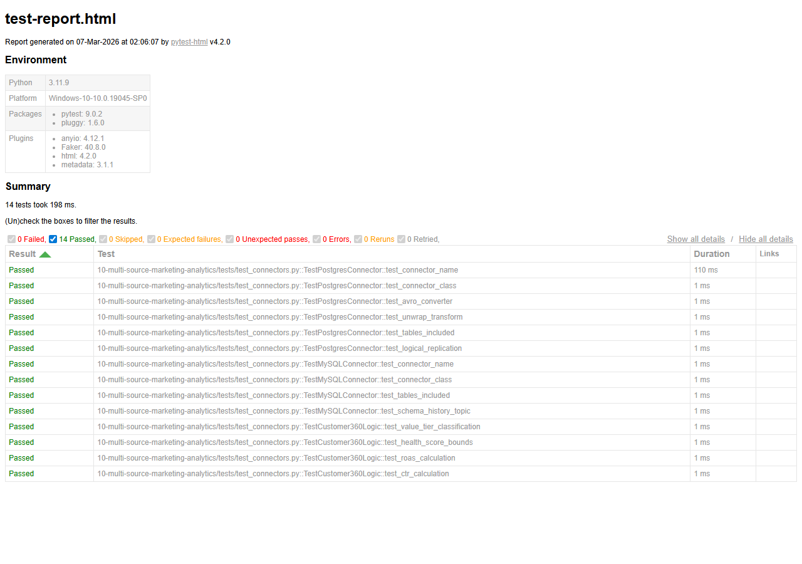

# Multi-Source Marketing Analytics Pipeline

[](https://www.python.org/downloads/)
[](https://debezium.io/)
[](https://kafka.apache.org/)


## Demo



*Marketing analytics with Debezium CDC connectors, campaign ROI analysis, and Customer 360 value tier breakdown (Platinum to Prospect)*

## Architecture

```
+--------------+    +---------+    +--------------+
|  PostgreSQL  |--->|Debezium |--->|              |
|  (CRM Data)  |CDC |Connector|    |              |
+--------------+    +---------+    |              |
+--------------+    +---------+    |    Kafka     |    +----------+    +---------+
|    MySQL     |--->|Debezium |--->|   Topics     |--->|  Spark   |--->|Snowflake|
|  (E-comm)    |CDC |Connector|    |  (Avro +     |    |  ETL     |    |   DWH   |
+--------------+    +---------+    |  Schema Reg) |    +----------+    +----+----+
+--------------+    +---------+    |              |                        |
|  REST APIs   |--->|  Kafka  |--->|              |                   +----+----+
|(GA, Ads, FB) |    |Producer |    |              |                   |   dbt   |
+--------------+    +---------+    +--------------+                   | Models  |
                                                                      +----+----+
                                                                           |
                                                                    dim_customer_360
```

## Features

- Debezium CDC: Real-time change capture from PostgreSQL + MySQL
- Kafka Connect: Managed connectors with Avro serialization + Schema Registry
- Multi-Source REST: Google Analytics, Google Ads, Facebook Ads API integrations
- Schema Registry: Avro schema evolution and compatibility
- dbt Transformation: SCD Type 2 snapshots, dim_customer_360
- Star Schema: Full dimensional model with facts and dimensions
- Docker Compose: Complete local development environment

## Quick Start

```bash
cp .env.example .env
docker-compose up -d

# Register Debezium connectors
python -m connectors.register_connectors

# Start REST API producers
python -m producers.marketing_producer

# Run dbt models
cd dbt_project && dbt run
```

## Project Structure

```
|-- config/                  # Settings and connector configs
|-- connectors/              # Debezium connector registration
|-- producers/               # REST API -> Kafka producers
|-- consumers/               # Kafka -> Snowflake consumers
|-- dbt_project/             # Full dbt transformation layer
|   |-- models/staging/      # Source staging views
|   |-- models/intermediate/ # Business logic
|   |-- models/marts/        # Star schema (facts + dims)
|   `-- snapshots/           # SCD Type 2 tracking
|-- schemas/                 # Avro schema definitions
|-- docker-compose.yml       # Full local stack
`-- tests/                   # Unit tests
```


## Test Results

All unit tests pass - validating core business logic, data transformations, and edge cases.



**14 tests passed** across 3 test suites:
- TestPostgresConnector - Debezium config, Avro converters, table inclusion
- TestMySQLConnector - connector class, schema history topic
- TestCustomer360Logic - value tier classification, health score bounds, ROAS/CTR

## Maintainer

Ragul Kumar Venkateswaran is a Data Engineer with 4+ years of experience designing and maintaining scalable data pipelines, models, and BI solutions across GCP, Azure, and Snowflake. He specializes in Python, SQL, Airflow, and dbt for data orchestration, ETL automation, and governance.

- Email: ragulkumar2611@gmail.com
- LinkedIn: linkedin.com/in/ragulkumar
- GitHub: github.com/ragulkumar